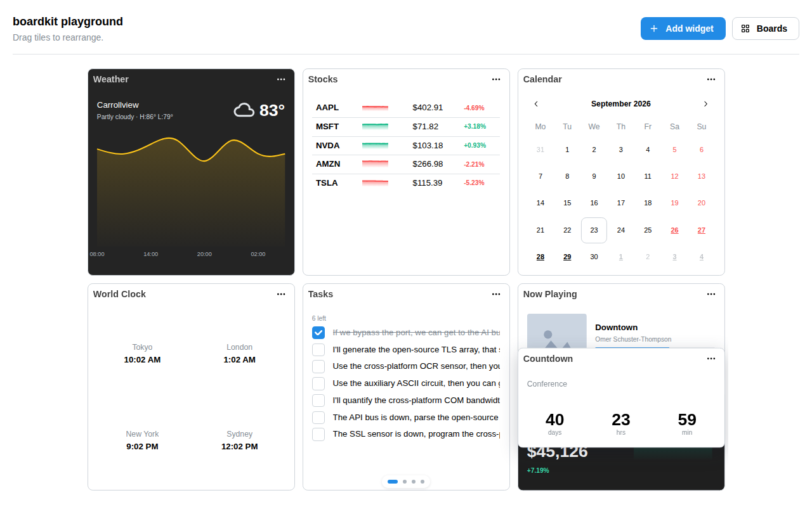

<div align="center">


# BoardKit

**Drag-and-drop widget dashboards for React.**<br />Write each widget once. BoardKit handles the layout, the dragging and every screen size.

[](https://www.npmjs.com/package/boardkit-react)
[](https://bundlejs.com/?q=boardkit-react)
[](LICENSE)
[](packages/react/src/index.ts)

[Live demo](https://brian7989.github.io/BoardKit/) · [Docs](docs/getting-started.md) · [Quick start](#quick-start)



</div>

## Why BoardKit

- **Write widgets, not layout code.** Each widget size is drawn once at a fixed pixel size and scaled to fit, so widgets never need media queries or responsive CSS.
- **Drag and drop that just works.** Tiles push each other out of the way, moving as few as possible; a drop that can't fit simply snaps back. Touch uses a long-press, so scrolling never turns into a drag.
- **Every screen size, remembered.** Define grids per breakpoint. Each one keeps its own arrangement, so resizing a window never scrambles the user's layout.
- **Saved for you.** Pass a `storageKey` and the board persists itself, repairing old or corrupted saves on load.
- **Your design system.** BoardKit draws the grid and tiles; menus, buttons and dialogs are yours, built on simple hooks. Mantine, shadcn, plain HTML — anything works.

Also included: resize, floating tiles, stacked widgets, multiple pages, typed results for moves that can't fit, SSR/Next.js support, and a zero-dependency layout engine — about 21 kB gzipped in total.

## Install

```sh
npm i boardkit-react
```

Requires React ≥18. `boardkit-core`'s types and helpers (`cell`, `boardId`, `OpType`, ...) are re-exported from `boardkit-react`, so most apps never import it directly.

## Quick start

```tsx
import { BoardProvider, Board, defineBoards, defineWidget } from 'boardkit-react';
import 'boardkit-react/styles.css';

const clock = defineWidget({
  type: 'clock',
  title: 'Clock',
  sizes: ['1x1'],
  defaultProps: { label: 'Local time' },
  component: ({ props }) => <div>{props.label}</div>,
});

const boards = defineBoards({ grid: { cols: 6, rows: 4 }, widgets: [clock], initialLayout: [{ widget: 'clock' }] });

export function App() {
  return (
    <BoardProvider config={boards} storageKey="my-board">
      <Board />
    </BoardProvider>
  );
}
```

`defineWidget` infers a widget's props from its `component`/`defaultProps` — no generic to write. `sizes` takes `'2x1'`-style shorthand or `{ w, h }` cells. The board above starts from `initialLayout` and then persists and reloads itself under `storageKey`, with no state of your own to wire up.

## Guides

| Guide | Covers |
|---|---|
| [Getting started](docs/getting-started.md) | Installing, your first board, the shape of a widget. |
| [Widgets](docs/widgets.md) | `defineWidget`, sizes, the fixed design size, `useWidget`, `noDragProps`. |
| [Boards & state](docs/boards-and-state.md) | Controlled vs. uncontrolled, `initialLayout`, `storageKey`, repair. |
| [Layout & breakpoints](docs/layout-and-breakpoints.md) | The grid array, per-breakpoint layouts, reflow, `useGrid`. |
| [Chrome](docs/chrome.md) | `tileHeader`, `tileOverlay`, menus, add-widget, page dots, toasts. |
| [Styling](docs/styling.md) | CSS variables and `data-bk-*` attributes. |
| [Engine](docs/engine.md) | Using `boardkit-core` standalone, with no React. |
| [API reference](docs/api.md) | Every export of `boardkit-react`, one line each. |
| [FAQ](docs/faq.md) | Widget vs. panel, browser support, performance. |

<details>
<summary><strong>Advanced: per-tile hooks</strong></summary>

Every structural action (resize, float, stack, rename, remove) is a hook, for building your own tile header:

```tsx
import { noDragProps, useTile, type TileHeaderProps } from 'boardkit-react';

function TileHeader({ tile, name }: TileHeaderProps) {
  const { float, remove } = useTile(tile);
  return (
    <div style={{ display: 'flex', justifyContent: 'space-between' }}>
      <strong>{name}</strong>
      <span {...noDragProps()}>
        <button onClick={() => float.toggle()}>{float.isFloating ? 'Unfloat' : 'Float'}</button>
        <button onClick={() => remove()}>Remove</button>
      </span>
    </div>
  );
}
```

Hand it to `BoardProvider` as `tileHeader={TileHeader}`. See [Chrome](docs/chrome.md) for the rest.

</details>

## License

MIT © Brian Taesung Lee — see [LICENSE](LICENSE).
